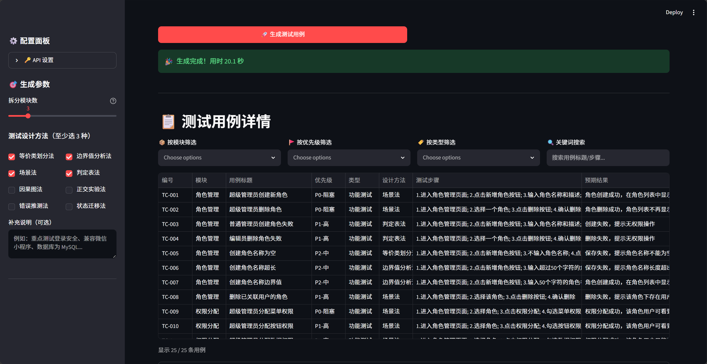
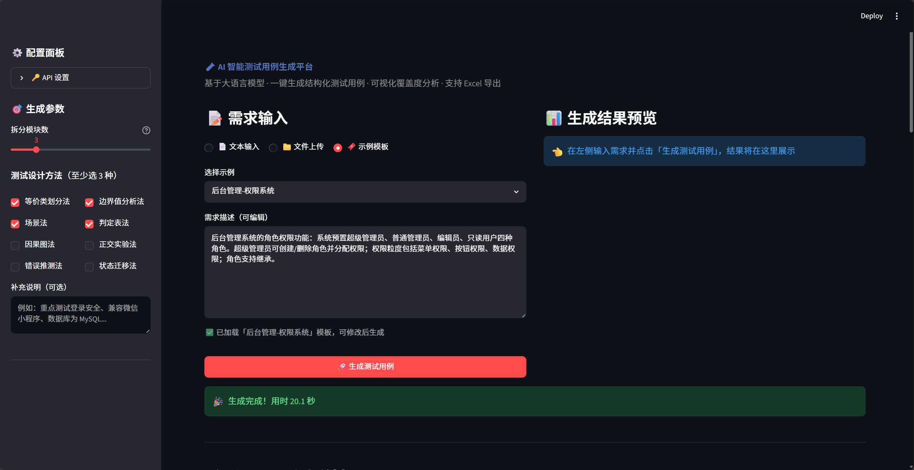
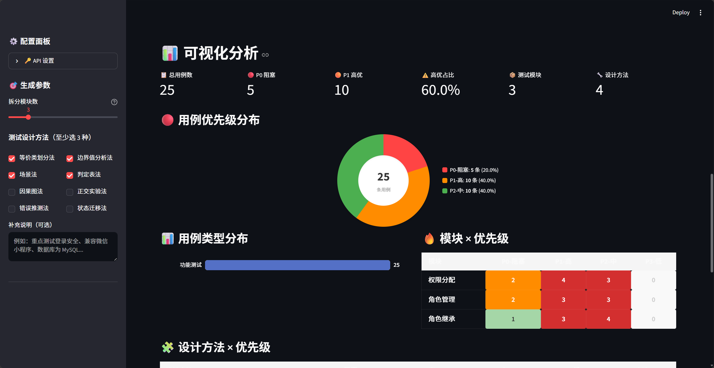

# 🧪 AI 智能测试用例生成平台

> 基于大语言模型（DeepSeek / 通义千问）的测试用例自动生成工具，输入需求描述即可生成结构化测试用例，并提供可视化覆盖度分析。

## 🎯 项目亮点

- 🤖 **AI 驱动**：基于 DeepSeek / 通义千问大模型，自动理解需求并生成专业测试用例
- 📋 **结构化输出**：每条用例包含编号、模块、标题、步骤、预期结果、优先级、设计方法等完整字段
- 📊 **多维可视化**：优先级分布、类型占比、模块热力图、设计方法旭日图，一键掌握覆盖全貌
- 🎯 **覆盖度评估**：自动化评分体系，从模块/类型/方法/优先级四个维度量化评估
- 📥 **一键导出**：支持 Excel / CSV 格式导出，无缝对接测试管理流程
- 🔧 **8 种设计方法**：等价类、边界值、场景法、判定表、因果图、正交实验、错误推测、状态迁移

## 🛠️ 技术栈

| 层次 | 技术 | 说明 |
|------|------|------|
| 前端框架 | **Streamlit** | Python 原生 Web 框架，快速构建数据应用 |
| AI 引擎 | **DeepSeek API** / **通义千问 API** | 大语言模型，支持中英文需求理解 |
| 数据处理 | **Pandas** | 用例数据的清洗、筛选、统计分析 |
| 可视化 | **Plotly** | 交互式图表：饼图、柱状图、热力图、旭日图 |
| 导出 | **openpyxl** | Excel 文件生成，支持列宽自适应、首行冻结 |

## 📁 项目结构

```
ai-test-generator/
├── app.py                  # Streamlit 主应用入口
├── config.py               # 配置管理（API Key、常量、颜色主题）
├── llm_client.py           # LLM API 客户端封装（DeepSeek / 通义千问）
├── testcase_generator.py   # 核心业务：Prompt 构建 + 用例生成 + 数据清洗
├── visualization.py        # 数据可视化模块（Plotly 图表）
├── utils.py                # 工具函数（Excel/CSV 导出、覆盖度评分）
├── requirements.txt        # Python 依赖
└── README.md               # 项目文档
```

## 🚀 快速开始

### 1. 克隆项目

```bash
git clone https://github.com/yourname/ai-test-generator.git
cd ai-test-generator
```

### 2. 安装依赖

```bash
pip install -r requirements.txt
```

### 3. 配置 API Key

**方式一：环境变量（推荐）**

```bash
# Windows PowerShell
$env:DEEPSEEK_API_KEY="sk-your-api-key"

# Mac / Linux
export DEEPSEEK_API_KEY="sk-your-api-key"
```

**方式二：在应用侧边栏输入**

启动后在左侧「API 设置」面板中输入 Key。

> 💡 [获取 DeepSeek API Key](https://platform.deepseek.com/api_keys)（新用户免费额度）

### 4. 启动应用

```bash
streamlit run app.py
```

浏览器访问 `http://localhost:8501` 即可使用。

## 📖 使用指南

### Step 1: 输入需求
- **文本输入**：直接粘贴需求描述
- **文件上传**：支持 TXT / Markdown 格式
- **示例模板**：内置电商、后台管理、金融、社交等场景模板

### Step 2: 配置参数
- 选择测试设计方法（推荐 3-5 种）
- 设置模块拆分数量
- 添加补充说明（可选）

### Step 3: 生成 & 分析
- 点击「生成测试用例」，AI 自动生成 15-25 条结构化用例
- 查看可视化分析图表
- 根据覆盖度评分调整参数

### Step 4: 导出
- 下载 Excel / CSV 文件
- 导入测试管理工具（禅道、Jira、TestLink 等）

## 🎨 功能截图

### 主界面 — 需求输入


### 生成结果 — 用例表格 + KPI


### 可视化仪表盘 + 覆盖度评分


> 📸 截图操作指南见 [screenshots/截图指南.md](screenshots/截图指南.md)

## 📊 覆盖度评分体系

| 维度 | 权重 | 评分标准 |
|------|------|----------|
| 模块覆盖 | 25 分 | 模块数 × 8，上限 25 |
| 类型覆盖 | 25 分 | 用例类型数 × 8，上限 25 |
| 方法覆盖 | 25 分 | 设计方法数 × 8，上限 25 |
| 优先级分布 | 25 分 | P0 占比 10-25% 且 P1 占比 25-45% 为满分 |

- **≥ 80 分**：✨ 覆盖度优秀
- **60-79 分**：👍 覆盖度良好
- **< 60 分**：📝 建议调整参数

## 🔮 后续扩展方向

- [ ] 支持批量导入需求文档（Word/PDF 解析）
- [ ] 用例评审 Agent（AI 自动检查用例质量）
- [ ] 集成 RAG 知识库（复用历史测试用例）
- [ ] 对接禅道/Jira API，一键提交用例
- [ ] 生成自动化测试脚本（Playwright/Pytest）
- [ ] 多轮对话式用例优化

## 👤 作者

- 技术栈：Python / Java / 深度学习 / 自动化测试 / 性能测试 / 数据可视化
- 求职方向：软件测试 / 测试开发
